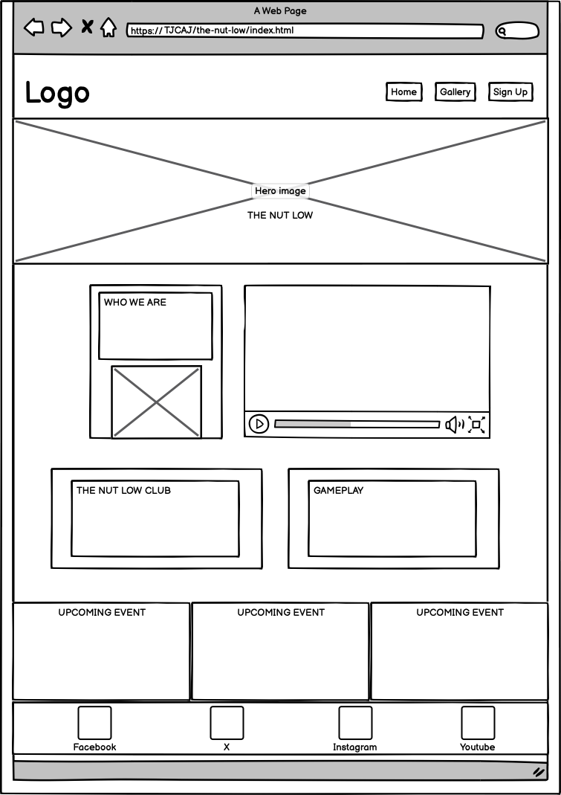

# The Nut Low

The Nut Low is a website customised for a small and very specific target group. This is for members in a local poker club in Stockholm, Sweden. Created to make it easier for members to meet, socialise and playing poker together. It will be a handy tool for members and useful to schedule tournaments more frequently. The website also aims to explain the basics of some of the most common poker games. [View the live site here](https://tjcaj.github.io/tnl/index.html)

This my first Milestone project for Code Institute's Full Stack Software Development Diploma. It was built using HTML and CSS. GitPod was used for writing the code for this website, as well as committing and pushing to GitHub. GitHub was then used to store the project after it had been pushed from GitPod. I choosed to deploy the website via GitHub quite early in the development process, as I figured it made sense to test my modest coding skills and try to minimalize errors before submission.

## Design

The looks and the feel of the website is created with red, white green and black colours. Inspired from the most common colours related to playing poker and other card games. This also helps to user visual with strong contrasts and is easy to navigate through.

## Features

- __Navigation Bar__

  - Visible on all the website pages. Consists of a logo, links to Home, Gallery and a Log in/Sign up page that will be responsive on all devices. This will allow users navigate the website's pages on any device in a seamless flow without having to revert back to the previous page via the ‘back’ button. I decided to have the menu to the right on devices with a size over 600px wide and centered on smaller devices as you click on the navbar bars. The logo is my own design created with an ai tool from [Design.com](https://www.design.com/) positioned to the left in the navbar.

Mobile/smaller devices version

- __The landing page image__

  - The landing page image is an ai generated picture that I’ve generated through [fotor.com](fotor.com) It consists of a classic poker table with a player visible in a dark and smoky room. This introduces the user to the website with a strong visual animation in order to to grab their attention. In a simple way it also reveals the main topic for the website.

## Website information

The main body of the homepage welcomes the user and intend to describe what and who it is created for via clear and consist information about KPC United’s poker club in Stockholm, Sweden. 

- __Who we are__
Here I added a separate description about the club, its members and a brief historic background as an introduction and helpful guide to new users and whoever is interested in joining the club.

- __Be inspired__
As part of an making the website more interesting and always relevant, I also added a link to the World Poker Tour live stream (WPT Live!) on Youtube in the first section on the page.

- __The Nut Low Club__

 Is a vital part of the website with information about membership fees and membership perks for the user.

 

 - __Gameplay__

 Is a short and informative part of the website with basic information about the rules playing Texas HoldEm poker where I added a link to Wikihow withe a more elaborated description about how to play and what to consider as a poker player.

 

- __Meetup Times section__

  - This section will allow the user to see dates for upcoming poker tournaments and who hosts the event.
  - My intention is that this section will be automatically updated with status of seats taken and when it's fully booked, as the members sign up for each event via the Log in/Sign up form. As for now this update is done manually by the administrator.
  - In this way this section helps to keep the user up to date.

  

- __The Footer__ 

  - The footer is visible on all pages. This section contain icons as links to social media sites for members to share their love for poker. The links opens to a new tab to allow easy navigation and accessible to the visually impaired who may be using a screen reader, by the use of aria labels.

  - The footer is valuable to the user as it encourages them to stay connected and up to date via social media.

- __Gallery__

  - The Gallery consist of pictures from pexels.com for now. It is added to the website in order to inspire how fun and exciting it is to play poker with KPC United.
  -  I’ve made sure that all the images was processed and compressed in file size via Adobe Photoshop to compressed .webp-files in order to enhance the user experience.

- __The Log in/Sign up Page__

  - This page will help the user to log in on their account and submit to upcoming poker tournaments under the auspices of KPC. The user will be able specify the date they would like take a seat with a maximum of 16 players at every event. The user will be notified of their status via email from the KPC administrator. I find it cool to have both a signup and a login function to the website so it's as easy for members to log in to their personal pages, and for aspiring memnbers to sign up for a new account.

  

  - __Membership Guidelines__
As the website deals with gambling I decided to add this information about the guidlines for members of KPC United. This was made with feedback from friends and family about this project.

### Features Left to Implement

- As future enhancements, the Log in/Sign Up form can generate an an immediate and automatic response to the user with a clear message of their status - a.k.a. if the user gets a seat at the upcoming event or not. In this way the user can always log in to check their status.
- The Gallery can certainly be improved with a rolling gallery where images shift frequently or at least having the images enhanced when clicked on, and also allow for users to upload their own pictures related to KPC United poker games.
- The website can be structured in a more informative and user friendly way with more content/pages that describes the most popular poker games in more details, with tips and tricks to improve your game as a poker player.
- A blog could be added as it allow people to share their thoughts and experiences about the website, the club and poker in general. This would better the way for users to interact with one another and help to improve the website as a whole.
- More links can also be added to various online poker card rooms with descriptions of what services the provide.

## Design

- Home

- Gallery

- Sign Up

## Testing 

Information about the tests can be viewed [here](Test.md)

### Validator Testing 

- HTML
  - No errors was found be passing through the official [W3C validator](https://validator.w3.org/nu/?doc=https%3A%2F%2Fcode-institute-org.github.io%2Flove-running-2.0%2Findex.html)

- CSS
  - No errors was found when passing through the official [(Jigsaw) validator](https://jigsaw.w3.org/css-validator/validator?uri=https%3A%2F%2Fvalidator.w3.org%2Fnu%2F%3Fdoc%3Dhttps%253A%252F%252Fcode-institute-org.github.io%252Flove-running-2.0%252Findex.html&profile=css3svg&usermedium=all&warning=1&vextwarning=&lang=en#css)

  

### Issues encountered

- The favicon were customised  with favicon.io and copied into the code according to their info, but at first when the website was loaded it wasn't showing. This was solved by relinking the images  from the right folder.

- The Navbar was something I spent way to much time trying to figure out why the code didn’t respond as I intended with a similar solution to the Love Running project. Having the menu items visible on larger screens and just a menu bar on phones and similar devices with smaller screens. My initial intention to have a checkbox with a similar solution to The Love Running project diddn't work out for me, so in the end I decided to go with javascript solution that I googled and found on Youtube. This is a solid solution credited under Acknoledgements, that I redisigned a bit to work for this website.

- Setting up the Signup page was also kind of an hurdle to me, because I wanted to integrate a slick version of this function that I found via google (also credited under Acknowledgements). I used the basic code for this form under the license of [Ivan Grozdic]('https://codepen.io/ig_design/pen/KKVQpVP') but modified it so the design reflects my own choice of colours and margins etc.

 - In order to make the Gallery responisve I was adviced by my mentor to look at a [Youtube video](https://youtu.be/2uvyx4YK_rQ?feature=shared) about Flexbox. This helped me in my efforts to create a responsive gallery. This is credited in Acknowledgements.

 - GitPod in Visual studios on my MacBook Pro didn’t work as easy as working directly in the browser for me. As a beginner with all these new platforms and development tools it is a constant battle trying to understand why and how all functions works in each dev tool. A simple thing here was that I couldn’t change the text in Visual studios. Nothing happened and it was hard to google any answers. For me it was easier to stick to the browser that worked as submission day closed in. Ath the end I got help via Slack by user Jörgen_5p_lead (Jörgen Jonsson) to find out that this was caused by a plugin that I had activated in VS Studio. As I removed this plugin the IDE started to work correctly.

- Git commit… I am a beginner and this was a real struggle for me in the beginning as I tested out code and functionality on various elements  in a rapid haste. Made several errors with this, but as it goes one can only get better with experience. Googled a lot and studied the Love Running project several times to improve on this.

- The landing page image was not responsive at first. As I talked with my mentor he helped me figure out that it was easier to add the hero image as a < img > tag in the HTML rather than as a url and styling in the CSS. This solved my issue.

- The menu bar was a hard and lasting problem for me. I couldn’t understand why it didn’t work despite that the code looked good to me, accordingly to the method I’ve learned in the Love Running Project. The real mental breakthrough was unexpected. I simply made an error in the CSS styling as I started to add headings and paragraphs to the main section. I typed { ( which resulted in breaking up my code and (!) Showing the menu bar as intended on smaller devices with the correct function in place… However after several attempts to understand why this happened I also had the misfortune to miss out on my second mentor call due to a late train... I thought I knew it had something to do with the flex box properties that I couldnt get my head around ths time, whilst I decided to try a solution with javascript from a youtube video. This is a better solution but it is still not quite ready.

- The site was deployed to GitHub pages. But it was not without a minor issue. As I deployed my website it didn’t go through Github for a long time. Then I realised that it was due to the fact that I hadn’t pushed my last commits. This made the deployment to fail. The solution again was to google and find the answer. 

### Unfixed Bugs

## Deployment

  - The site was deployed to GitHub pages. The steps to deploy are as follows: 
  - In the GitHub repository, navigate to the Settings tab 
  - From the source section drop-down menu, select the Master Branch
  - Once the master branch has been selected, the page will be automatically refreshed with a detailed ribbon display to indicate the successful deployment. 

## Credits 

Inspiration for the readme file was taken from _The Love Running Project_ as well as my mentor _Gareth McGirr_ and my fellow students _Martiless (flawlesscooking)_, _Airdrie86 (life-hack)_ and _Kera Cudmore_. I also want to put in an extra credit to _Ivan Grozdic_, _IonaFrisbee_ and _Web Dev Simplified_ offering solutions and explanations to issues encountered.

## Acknowledgements

- Thanks to my mentor _Gareth McGirr_ for helpful feedback and creative input as well as mental support and encouragement by my student Cohort facilitator on Slack, _Kristyna Ci_.

- I also relyed on The Love Running Project for basic structure of the website and the Meet Up Section.

- _The responsive navbar_ code and technology is fully based upon information from the Youtube channel [Web Dev Simplified](https://www.youtube.com/watch?v=At4B7A4GOPg)

- The desigm for _the gallery_ is based upon code that I learned via the [Dee Mc Coding channel](https://www.youtube.com/watch?v=2uvyx4YK_rQ) on Youtube. Run by user IonaFrisbee.

- In addition I had a code implemented for _the signup page_ from Ivan Grozdic at [codeopen.io](https://codepen.io/ig_design/pen/KKVQpVP) that I have changed a bit to better fit with my own webpage colours, fonts and logo. - This is built upon licensed sofwtware as stated here:

Copyright (c) 2024 by [Ivan Grozdic]('https://codepen.io/ig_design/pen/KKVQpVP')

Permission is hereby granted, free of charge, to any person obtaining a copy of this software and associated documentation files (the "Software"), to deal in the Software without restriction, including without limitation the rights to use, copy, modify, merge, publish, distribute, sublicense, and/or sell copies of the Software, and to permit persons to whom the Software is furnished to do so, subject to the following conditions:

The above copyright notice and this permission notice shall be included in all copies or substantial portions of the Software.

THE SOFTWARE IS PROVIDED "AS IS", WITHOUT WARRANTY OF ANY KIND, EXPRESS OR IMPLIED, INCLUDING BUT NOT LIMITED TO THE WARRANTIES OF MERCHANTABILITY, FITNESS FOR A PARTICULAR PURPOSE AND NONINFRINGEMENT. IN NO EVENT SHALL THE AUTHORS OR COPYRIGHT HOLDERS BE LIABLE FOR ANY CLAIM, DAMAGES OR OTHER LIABILITY, WHETHER IN AN ACTION OF CONTRACT, TORT OR OTHERWISE, ARISING FROM, OUT OF OR IN CONNECTION WITH THE SOFTWARE OR THE USE OR OTHER DEALINGS IN THE SOFTWARE.

## Technologies used

For the purpose of this project, the following technologies were used.
### Languages:
- HTML
- CSS

### Frameworks, Libraries, Programs & Applications Used:
### Google Font
Google fonts were used to import the following fonts Big Shoulders Display and  Paytone One. These were imported to style.css and were used throughout the project.

### Font Awesome
Font Awesome was used on each page of the website to provide icons for UX purposes.

### GitPod
GitPod was used for access to the student workspace and writing parts of the code for this project. It was also used to commit and push to GitHub.

### Visual Studio Code
The website was developed using Visual Studio Code IDE. It was used writing parts of the code for this project as well and to commit and push to GitHub.

### GitHub
GitHub was used to store this project.

### GitPages
GitPages was used to deploy the project.

### ### Balsamiq
Balsamiq was used to draw initial Wireframes for this project.

### Am I Responsive
Am I Responsive was used to check that each page of the site was responsive. It was also used to create the mock-up image seen at the beginning of this document.

### Google Development Tools
Google Dev Tools was used to edit code and check responsiveness before making the changes permanent.

### Adobe Photoshop
Photoshop was used to reduce the size of the images throughout the website.

### Font Awesome
Icons obtained from Font Awesome were used as the Social media links in the footer section.

## Content 

 - The gallery is based upon code from the [Dee Mc Coding channel](https://www.youtube.com/watch?v=2uvyx4YK_rQ) on Youtube.
- Code snippet for the the Log in/Sign Up page was takenfrom [codeopen.io](https://codepen.io/ig_design/pen/KKVQpVP)
- The icons in the footer and the menu bar were taken from [Font Awesome](https://fontawesome.com/)
- Information about creating a navbar toggle with Javascript was found on youtube and [Web Dev Simpified](https://www.youtube.com/watch?v=At4B7A4GOPg)

## Media

Favicon was created via favicon.io

Images - Pexels and private pictures.

Fonts - Google fonts.

Icons - Font Awesome.

Logo - Created with ai tool from [Design.com](https://www.design.com/)