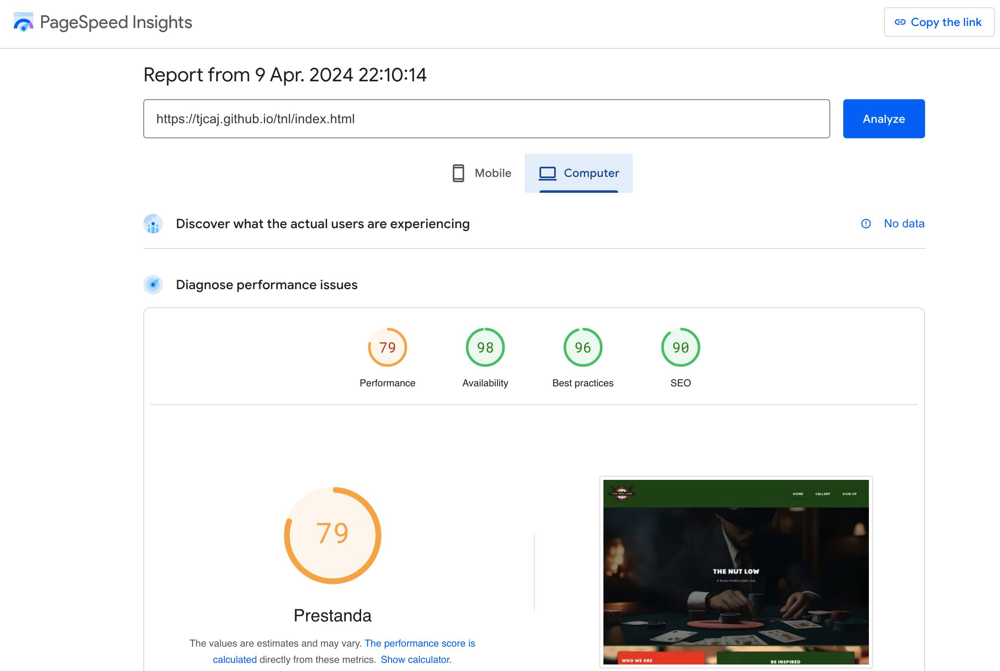
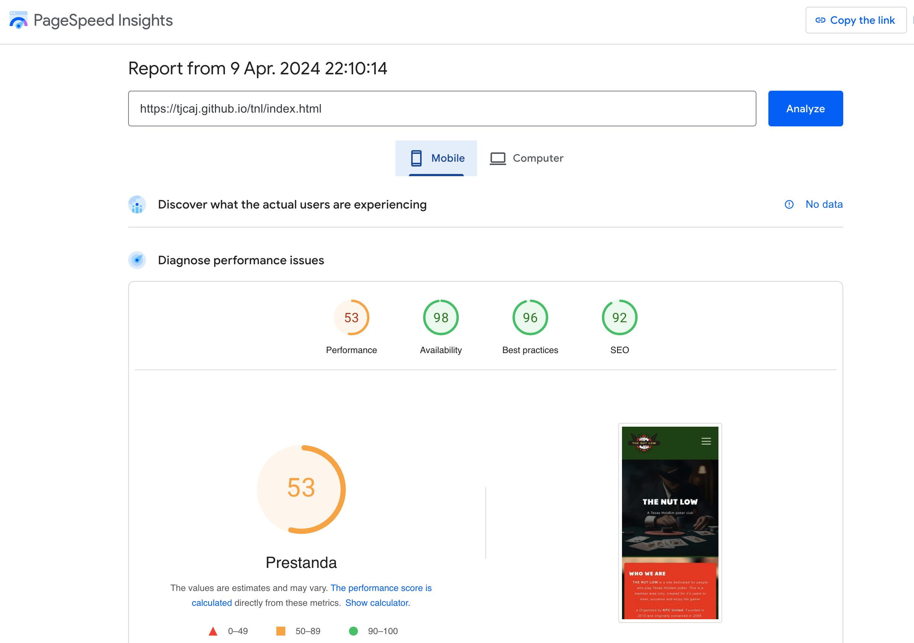
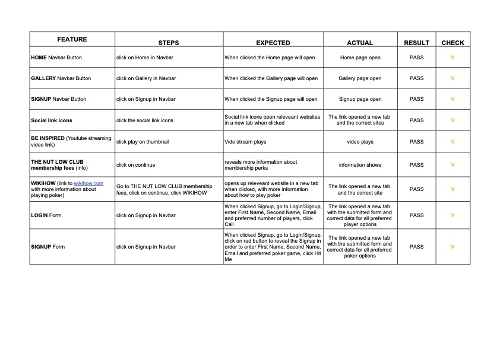
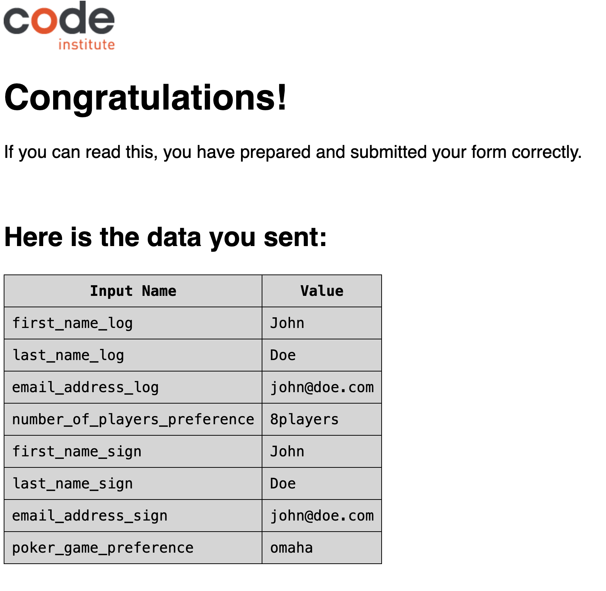

## Home

- Each button on the navigation bar were tested to make sure it brought you to the correct place.
- The logo in the header was tested to make sure you return to the home page when it is clicked on.
- Each social media icon in the footer was tested to make sure they not only opened in the correct social media pages but that they also opened in a new tab.
- Each field of the Login/Sig up form was tested to make sure if it was empty a warning popped up to let the user know the field was required and that the submit button worked as intended. 
- All links to external websites and Youtube have been checked to ensure that they are functional and up to date.

## Gallery
Header and footer as above.

## Log in/Sign up
Header and footer as above.

## Responsive characteristics

All pages were checked using Google Dev tools to make sure they were compatible on desktops, tablets and mobiles, to ensure responsiveness on screen sizes from 320px and upwards as defined in WCAG 2.1 Reflow criteria for responsive design. It was also tested using a MacBook Pro with external LG 5K screen, an iPad as well as in iPhone to make sure the website worked correctly.

Steps to test:

Open browser and navigate to The Nut Low
Open the developer tools (right click and inspect)
Set to responsive and decrease width to 320px
Set the zoom to 50%
Click and drag the responsive window to maximum width

## Browsers

The website was tested out on various web browsers to make sure everything loaded as intended. The browsers tested were: Google Chrome, Microsoft Edge and Safari.
During the development of the website was it was viewed by a number of members in KPC United as well as my mentor and closest family.

## Lighthouse Testing

Lighthouse Speedtest is documented in Readme but was also done on PageSpeed Insights.

Computer Speedtest

  

Mobile Speedtest

  

### **Initial tests**  
  
The primary goal for this project was to learn the basis of HTML and CSS while creating a responsive web page that can assist in connecting a specific target group as well as it delivers some entertainment and a chance to to learn more oabout poker for the user. After my first submission failure, I decided to clone my original PP1 project and continue to develop the project for a resubmssion. This is why I have quite a few commits.
  
- Macbook Pro (5120 X 2880)  
- LG HDR 4K" Monitor (3840x2160)
- iPad Pro 2021
- iPhone 12 Pro

Test sheet validation - no errors or warnings to show 

  

On desktop, the browsers that I had access to for testing were:

- <b>Chrome</b>
- <b>Safari</b> 

The results of feature testing in <b>Chrome</b>, <b>Firefox</b>, <b>Edge</b> and <b>Safarai</b> are as follows:

## Functional Testing

### Navigation Links
Testing was performed to ensure all navigation links on the respective pages, navigated to the correct pages as per design. This was done by clicking on the navigation links on each page. Links on all pages navigated to the correct pages as expected.

## Form Testing
The Signup / Login form was tested to ensure it function as expected. The following test scenarios were covered:

#### Scenario One - Correct Inputs
Steps to test:
Input the following data:
- Your  First Name: John
- Your  Last Name: Doe
- Your  Email: john@doe.com
- Choose preferred multiplayer mode with radio buttons
- Click Call

User should be redirected to https://formdump.codeinstitute.net/ confirmation page

Expected:
Form submits with no warnings or errors and user can click back to previous page.

Actual:
Website behaved as expected with no errors or warnings and user can click back to previous page.

#### Scenario Two - Missing Required Field Your First Name
Steps to test:
Scroll down to the form and input the following data:
- Your  First Name:
- Your  Last Name: Doe
- Your  Email: john@doe.com
- Choose preferred multiplayer mode with radio buttons
- Click Call

Expected:
As the field with Your First Name is not filled with a name the form will not submit and tell the user that the field is required.

Actual:
Website behaved as expected, a message was displayed that Your First Name must be filled in with a name and the form did not submit.

#### Scenario Three - Missing Required Field Your Last Name

Steps to test:
Scroll down to the form and input the following data:
- Your First Name: John
- Your Last Name:
- Your Email: john@doe.com
- Choose preferred multiplayer mode with radio buttons
- Click Call

Expected:
As the field with Your Last Name is not filled with a name the form will not submit and tell the user that the field is required.

Actual:
Website behaved as expected, a message was displayed that Your  Last Name must be filled in with a name and the form did not submit.

#### Scenario Four - Missing Required Field Your Email

Steps to test:
Scroll down to the form and input the following data:

- Your  First Name: Jon
- Your  Last Name: Doe
- Your  Email:
- Choose preferred multiplayer mode with radio buttons
- Click Call

Expected:
As the field with Your Email is not filled with a name the form will not submit and tell the user that the field is required.

Actual:
Website behaved as expected, a message was displayed that Your Email must be filled in with a name and the form did not submit.

## Footer Social Media Icons / Links
Testing was performed on the Font Awesome Social Media icons in the footer to ensure that each one opened in a new tab and that each one had a hover affect of the orange branding color.
Each item opened a new tab when clicked as expected and correct hover colour was present.

### The outcome of these test were:

- The menu bar didn’t work as it should when changing screen size on various devices with larger screen size.
- Page text and images were not aligned correctly. These issuses were then adjusted.

- All feedback was valuable for the development process and changes were made to improve the user experience.

- The result of the Lighthouse Speedtest reflects that the video link from youtube on the main page slows down the performance. This is possible to correct via lazy load but is not yet implemented.
